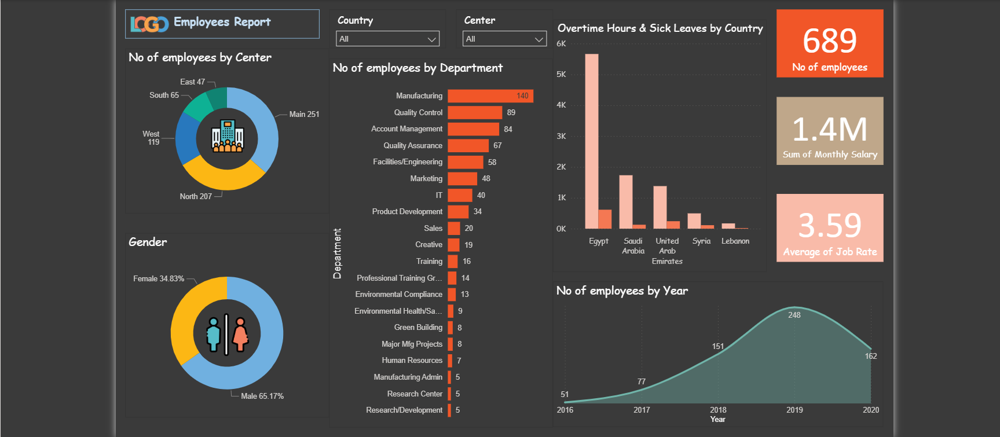

# HR-Analysis

This Power BI dashboard provides an overview of employee distribution, salary analysis, and workforce trends from 2016 to 2020.

## Key Insights
- **Total Employees:** 689  
- **Centers:** Main Center (36%, 251 employees) and North Center (30%, 207 employees) hold the largest shares.  
- **Gender:** Male employees represent 65%, while females make up 34%.  
- **Departments:** Manufacturing (140) and Quality Control (89) are the largest departments.  
- **Salaries:** Total monthly salary equals approximately 1.4M.  
- **Country:** Egypt recorded the highest Overtime Hours (5600) and Sick Leaves (615).  
- **Growth Trend:** Employee count increased steadily  
  Despite a slight drop in 2020, the overall trend reflects strong organizational growth.

## Dashboard Preview

---

*This project highlights HR data analytics, workforce trends, and performance insights using Power BI.*
